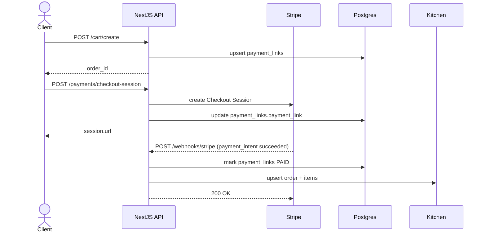
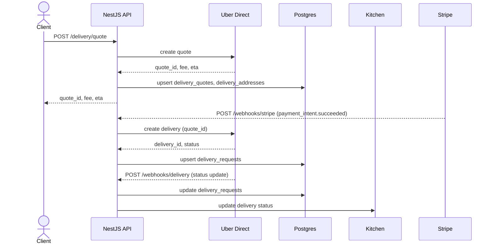

# Bite Creole Backend

Food restaurant system backend built with NestJS, Prisma, and Postgres. It supports menu, orders, kitchen ops, Stripe payments, and Uber Direct delivery for off‑premise orders.

**System Architecture**

```text
Client (Web/Phone/Tablet)
  |
  | 1) Create cart + quote + checkout session
  v
NestJS API
  |-- Payments Module (Stripe Checkout Session)
  |-- Delivery Module (Uber Direct quotes + delivery creation)
  |-- Kitchen Module (order state & production)
  |-- Webhooks Module (Stripe + Uber Direct events)
  |-- Prisma (Postgres)
  |
  +--> Stripe (payment processing)
  +--> Uber Direct (quotes + delivery)
```

**Core Flow Summary**

1. Client creates a cart and selects fulfillment (`pickup` or `delivery`).
2. If delivery:
   - Client requests a quote with structured dropoff address + `location_id` (pickup).
   - Quote is persisted and required before checkout.
3. Client creates a Stripe Checkout Session.
4. Stripe webhook confirms payment.
5. Backend creates kitchen order and, if delivery, auto‑creates Uber Direct delivery.
6. Uber Direct webhook updates order delivery status.

---

**Sequence Diagrams**

Stripe Checkout + Order Creation



Delivery Quote + Uber Direct



---

**Modules**

- `PaymentsModule`
  - Creates carts and Stripe Checkout Sessions.
  - Stores payment state and link in `payment_links`.
- `DeliveryModule`
  - Stores delivery addresses and quotes.
  - Integrates Uber Direct for quotes and delivery creation.
- `WebhooksModule`
  - Stripe `payment_intent.succeeded` → creates kitchen order.
  - Uber Direct delivery status webhook → updates order state.
- `KitchenModule`
  - Maintains operational order states and audit trail.

---

**Data Model Additions**

These tables were added to support structured delivery and locations:

- `locations`
  - Per‑location pickup address and phone.
- `delivery_addresses`
  - Dropoff address tied to `order_id`.
- `delivery_quotes`
  - Required quote before checkout, includes fee and provider data.

---

**Stripe Checkout Flow**

1. `POST /cart/create` creates a `payment_links` row for an order.
2. Client requests a delivery quote (required for delivery).
3. `POST /payments/checkout-session` creates Stripe Checkout Session:
   - Line items from cart
   - Delivery fee line item if delivery
   - Metadata attached to `payment_intent` for webhook processing
4. Stripe webhook creates the kitchen order and marks payment as PAID.

---

**Uber Direct Delivery Flow**

1. `POST /delivery/quote` calls Uber Direct quote API with:
   - `location_id` pickup address
   - structured dropoff address
2. Quote is persisted and returned to client.
3. After payment succeeds:
   - `createDeliveryAfterPayment` uses quote + addresses
   - Stores `delivery_id` in `delivery_requests`
4. Uber Direct webhook:
   - Verified by HMAC signature
   - Updates `delivery_requests`
   - Translates status to kitchen state (`out_for_delivery`, `delivered`)

---

**Key Endpoints**

Payments:
- `POST /cart/create`
- `POST /payments/checkout-session`
- `GET /payments/:orderId`

Delivery:
- `POST /delivery/quote`
- `POST /delivery/request` (legacy/manual stub)
- `POST /delivery/webhook` (legacy)
- `GET /delivery/:orderId/status`

Locations:
- `POST /locations`
- `GET /locations`
- `GET /locations/:id`

Webhooks:
- `POST /webhooks/stripe`
- `POST /webhooks/delivery` (Uber Direct + legacy)

---

**Environment Variables**

Stripe:
- `STRIPE_SECRET_KEY`
- `STRIPE_WEBHOOK_SECRET`

Uber Direct:
- `UBER_DIRECT_CLIENT_ID`
- `UBER_DIRECT_CLIENT_SECRET`
- `UBER_DIRECT_CUSTOMER_ID`
- `UBER_DIRECT_WEBHOOK_SECRET`
- `UBER_DIRECT_API_BASE` (optional, default `https://api.uber.com`)
- `UBER_DIRECT_AUTH_BASE` (optional, default `https://auth.uber.com`)

Frontend:
- `CUSTOMER_URL` or `FRONTEND_URL`

---

**Example Location**

```json
{
  "id": "loc_nj_1",
  "name": "Bite Creole - Newark",
  "phone": "+1-973-555-0147",
  "address_line1": "123 Market St",
  "address_line2": "Suite 2A",
  "city": "Newark",
  "state": "NJ",
  "postal_code": "07102",
  "country": "US"
}
```

---

**Notes**

- Delivery quote is required before checkout for delivery orders.
- Payment webhook is the source of truth for order creation.
- Delivery creation failures do not fail Stripe webhook processing (order is still created).
